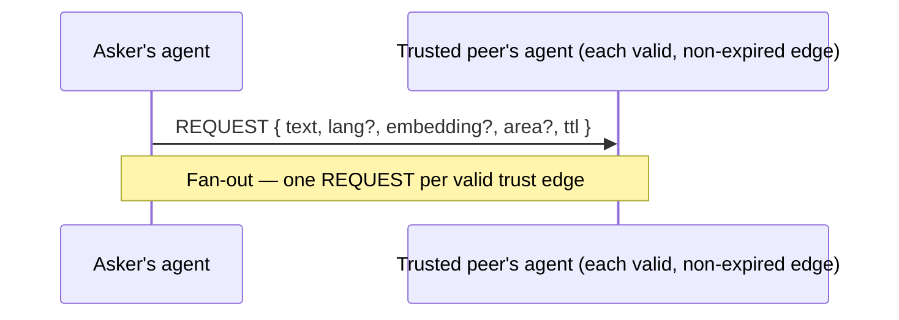
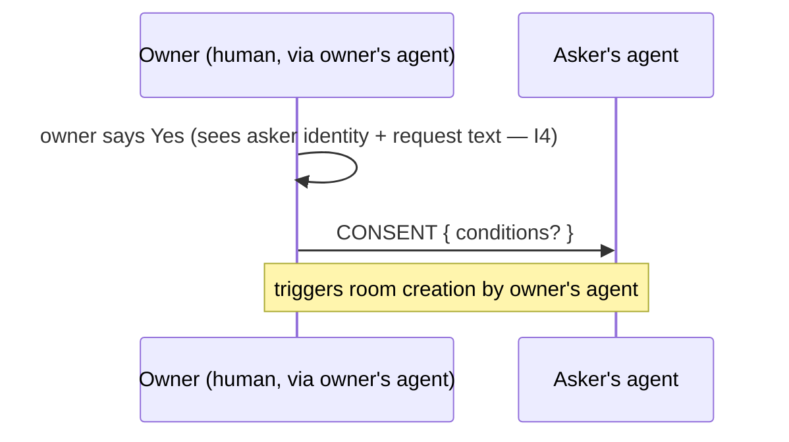
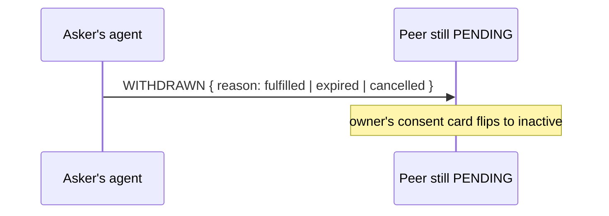
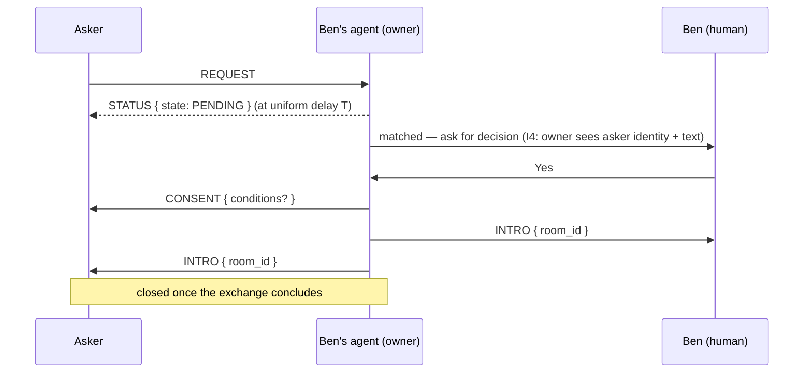
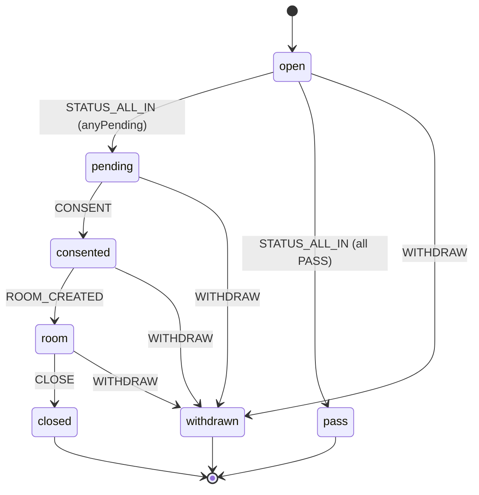
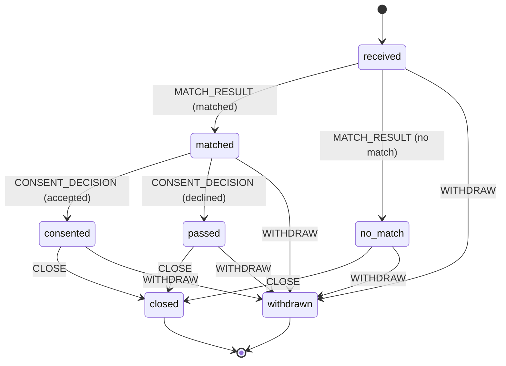

# PROTOCOL.md — resource-web wire protocol v0.1 (frozen)

Owned by `packages/protocol` (`@resource-web/protocol@0.1.0`). This package has
**zero runtime dependencies besides `zod`** and performs **no I/O** — it is
pure schemas, pure state-transition functions, and pure evaluation functions.
Everything in this document is implemented and unit-tested in
`packages/protocol/src/*.test.ts`; each invariant section below names the
tests that assert it.

> **Freeze notice:** this is the v0.1 contract. `packages/transport`,
> `packages/agent-daemon`, and both UIs are built against exactly what is
> described here. Changes after this freeze need main-thread approval.

> **Two implementation-hardening notes for consumers of this contract:**
> 1. Fields the brief's interfaces type as bare `string` — `peer`, `display`,
>    `Item.id`, `REQUEST.body.text`, `INTRO.body.room_id` — are validated here
>    with `.min(1)` (reject empty string). This is stricter than "implement
>    EXACTLY" the interfaces literally, adopted as a conscious hardening call;
>    a consumer sending `""` for any of these gets a parse error, not a
>    silently-accepted empty value.
> 2. `IsoDateTimeSchema` (`z.string().datetime()`) accepts **only** UTC
>    timestamps with a trailing `Z` — the same shape `Date#toISOString()`
>    produces. Offset forms like `+02:00` are rejected. Transport/daemon code
>    must always emit `Z`-suffixed timestamps on the wire.

## 1. Data model (HANDOVER §5.1)

### 1.1 `PeerId`

```ts
type PeerId = string; // v0: matrix user id ("@anna:matrix.example.org"); later: DID
```

### 1.2 `TrustEdge`

```ts
interface TrustEdge {
  peer: PeerId;
  display: string;
  vouched_by?: PeerId;      // who introduced them — future governance hook, not evaluated in v0
  created_at: string;
  expires_at?: string;      // default: created_at + 1y (I9)
}
```

`expires_at`, when omitted, defaults to **created_at + 1 year**, not
"now + 1 year" — an edge's expiry is a property of when the edge was made, so
the default is computed relative to its own `created_at` via an object-level
transform in `TrustEdgeSchema`, not the wall clock. See
`schemas.test.ts › TrustEdgeSchema`.

### 1.3 `Item`

```ts
interface Item {
  id: string;
  labels: string[];
  description: string;
  tags: string[];
  provenance:
    | { kind: "self" }
    | { kind: "second_brain"; owner: PeerId; noted_at: string }; // "A told me they have…"
  policy: SharePolicy;
  location_area?: string;    // coarse only, e.g. "Wien-Ottakring" — NEVER precise coordinates
  availability?: string;
}
```

`ItemSchema` is `.strict()` at every level (including `provenance`), so a
caller that accidentally attaches `gps: [lat, lng]` gets a validation error
instead of silently leaking precise location. See
`schemas.test.ts › ItemSchema › rejects unknown keys`.

### 1.4 `SharePolicy`

```ts
interface SharePolicy {
  audience: "private" | "trusted" | "wot_commons";
  mode: "ask_each_time" | "auto_forward";
  requires?: ("profile_photo" | "note_from_requester")[];
  expires_at?: string;       // default: now + 1y (I9)
}
```

Conservative defaults (I9), applied by `SharePolicySchema` at parse time:

| Field | Default when omitted |
|---|---|
| `audience` | `"trusted"` |
| `mode` | `"ask_each_time"` |
| `expires_at` | `defaultExpiryIso()` = now + 1 year, ISO-8601 UTC |

Because these are schema-level `.default()`s, any `SharePolicy` that has been
parsed through `SharePolicySchema` always has all three fields populated —
downstream code (`evaluatePolicy`) never has to handle "no expiry set."
See `schemas.test.ts › SharePolicySchema (I9 conservative defaults)`.

### 1.5 `DecisionLogEntry` (I6 auditability)

```ts
interface DecisionLogEntry {
  ts: string;
  request_id: string;        // uuid
  actor: "asker" | "owner";
  action: string;            // e.g. "sent_request" | "status_pass" | "consented" | "declined" | "withdrawn" | "room_created"
  reason?: string;           // optional human-readable rationale, local-only, never wire-transmitted
}
```

`protocol` exports only the shape (`DecisionLogEntrySchema`/`DecisionLogEntry`
in `decision-log.ts`). The daemon owns actually writing/reading a log file;
protocol does no I/O. See `decision-log.test.ts`.

## 2. Envelope & messages (HANDOVER §6.1)

Every wire message is wrapped in one envelope shape:

```ts
{ v: "0.1", type: "REQUEST"|"STATUS"|"CONSENT"|"INTRO"|"WITHDRAWN",
  request_id: uuid, ts: iso8601, body: {...} }
```

`EnvelopeSchema` is a `z.discriminatedUnion("type", […])` over five per-type
schemas, each `.strict()` at both the envelope level and the `body` level.
`serializeEnvelope`/`parseEnvelope` (in `envelope.ts`) validate on every
serialize/parse and reject: unknown `type`, extra top-level keys, extra body
keys, a non-`"0.1"` version, and a non-uuid `request_id`. See
`envelope.test.ts › EnvelopeSchema — versioning & discrimination`.

| Type | Direction | Body | Notes |
|---|---|---|---|
| `REQUEST` | asker → each trusted peer | `{ text, lang?, embedding?, area?, ttl }` | Fan-out to all valid (non-expired) trust edges. `ttl` is milliseconds until the request expires (a duration, not an absolute time) — the brief names the field but not its unit; milliseconds keeps it consistent with `statusDispatchAt`'s `delayMs`. |
| `STATUS` | every queried peer → asker | `{ state: "PASS" \| "PENDING" }` | Sent by **every** queried peer at uniform delay `T` (default 30s, no jitter). `PASS` = no-match OR declined — byte-identical (I3). `PENDING` = owner is being asked. |
| `CONSENT` | owner → asker | `{ conditions?: string }` | Follows the owner's Yes; triggers room creation. `conditions` (DECISIONS.md D1.6): the consenting owner may attach conditions for giving the item out. Omitted field serializes identically to `{}` — `conditions` is `.optional()` (never `.nullable()`/`.default("")`), so an absent value round-trips to no key at all. See `envelope.test.ts › EnvelopeSchema — CONSENT`. |
| `INTRO` | room creator → participants | `{ room_id }` | Both humans + both agents invited; context card posted (daemon/transport responsibility, not this package). |
| `WITHDRAWN` | asker → peers still pending | `{ reason: "fulfilled" \| "expired" \| "cancelled" }` | Owner's consent card flips to inactive. |

### 2.1 `REQUEST`



### 2.2 `STATUS`

```mermaid
sequenceDiagram
    participant Asker as Asker's agent
    participant Peer as Peer's agent
    Asker->>Peer: REQUEST
    Note over Peer: received_at = now; matching/consent computed locally
    Note over Peer: dispatch_at = statusDispatchAt(received_at) — fixed delay, no jitter
    Peer-->>Asker: STATUS { state: PENDING }  (owner is being asked)
    Peer-->>Asker: STATUS { state: PASS }     (no-match OR declined — same body either way)
```

I3 in one picture: the two `STATUS{state:"PASS"}` arrows above are
byte-identical on the wire regardless of *why* the peer is passing — see
§4 below.

### 2.3 `CONSENT`



### 2.4 `INTRO`

```mermaid
sequenceDiagram
    participant Owner as Owner's agent (room creator)
    participant OwnerHuman as Owner (human)
    participant AskerHuman as Asker (human)
    participant Asker as Asker's agent
    Owner->>OwnerHuman: INTRO { room_id }
    Owner->>AskerHuman: INTRO { room_id }
    Owner->>Asker: INTRO { room_id }
    Note over Owner,Asker: both humans + both agents invited; context card posted
```

### 2.5 `WITHDRAWN`



### 2.6 Full lifecycle (happy path)



## 3. Request lifecycle state machine

Two independent pure state machines in `state-machine.ts`, one per side of a
request. Both throw on an invalid `(state, event)` pair; neither performs I/O.

### 3.1 Asker side

```
open --STATUS_ALL_IN(anyPending=true)-->  pending
open --STATUS_ALL_IN(anyPending=false)--> pass
pending --CONSENT-->                       consented
consented --ROOM_CREATED-->                room
room --CLOSE-->                            closed
{open, pending, consented, room} --WITHDRAW(reason)--> withdrawn
```



TTL expiry is modeled as `WITHDRAW` with `reason: "expired"` — not a separate
state or event — valid from any active state, same as any other withdrawal.
This keeps one event shape per side and maps 1:1 onto `WITHDRAWN.reason`. See
`state-machine.test.ts › "TTL expiry models as WITHDRAW with reason 'expired'"`.

### 3.2 Owner side

```
received --MATCH_RESULT(matched=true)-->  matched
received --MATCH_RESULT(matched=false)--> no_match
matched --CONSENT_DECISION(accepted=true)--> consented
matched --CONSENT_DECISION(accepted=false)--> passed
{consented, passed, no_match} --CLOSE--> closed
{received, matched, no_match, consented, passed} --WITHDRAW(reason)--> withdrawn
```



**Interpretation call, documented rather than silently assumed:** the brief's
chain — "`received → matched/no_match → (consent pending) → consented/passed →
closed/withdrawn`" — reads ambiguously about whether `no_match` feeds forward
into the final `closed`/`withdrawn` step or is a dead end. This implementation
wires `no_match` the same as `passed`: every request record, matched or not,
needs a way to be closed out or withdrawn. See
`state-machine.test.ts › owner-side incoming-request lifecycle`.

## 4. `SharePolicy` evaluation

`evaluatePolicy(item, request, edge, now) → { eligible, needsConsent, requires }`
in `policy.ts`. It has two independent jobs:

1. **Audience gating → `eligible`.**
   - `private` — never eligible.
   - `trusted` — eligible only with a valid, non-expired `TrustEdge`.
   - `wot_commons` — eligible without needing a trust edge at all
     ("discoverable through me without per-request ping" describes the
     *audience* check: no edge lookup is required to decide eligibility).
   - An expired `SharePolicy`, or (for `trusted`) an expired edge, makes an
     item **not eligible** regardless of audience (I9).
2. **Mode → `needsConsent`**, independent of audience.
   - `ask_each_time` → `true`.
   - `auto_forward` → `false`.

**Interpretation call:** a `wot_commons` item with `mode: "ask_each_time"`
still needs a per-request consent ping; only its *discoverability* skips the
edge check. The brief's one-line gloss on `wot_commons` could be misread as
"never needs consent" — it isn't, per the brief's own two-bullet structure
(audience gating vs. mode are listed as separate concerns). See
`policy.test.ts › evaluatePolicy — mode drives needsConsent independently of audience`.

`requires` is a pass-through of `item.policy.requires`, defaulting to `[]`.

## 5. Uniform-STATUS scheduling helper

`statusDispatchAt(receivedAt, delayMs = 30_000): iso` in `scheduling.ts`.
Deterministic: `dispatch_at = receivedAt + delayMs`, no jitter, no randomness.
Matching/consent computation must never feed into this function — it is
called with the REQUEST's receipt time only, so *when* a peer answers reveals
nothing about *what* they'll answer. See `scheduling.test.ts`.

## 6. Invariants I1–I9, restated as testable assertions

| # | Invariant | Testable assertion | Where tested |
|---|---|---|---|
| I1 | Local sovereignty: inventory never leaves the owner's device except local match results + post-consent item details. | The protocol package defines no message type that carries an `Item[]` list or full inventory; only `REQUEST` (asker's own text/context) and post-consent flows (`CONSENT`/`INTRO`) cross the wire. Structural: grep `envelope.ts` body schemas — none references an item array. | `envelope.test.ts` (body shape coverage — no inventory field exists to test the absence of) |
| I2 | Asker blindness: REQUEST/STATUS bodies carry no owner identity or inventory. | `RequestBodySchema` = `{ text, lang?, embedding?, area?, ttl }` and `StatusBodySchema` = `{ state }`, both `.strict()` — no `owner`, `peer`, or item-identifying field exists in either schema, so any attempt to add one is a type/parse error. | `envelope.test.ts › EnvelopeSchema — REQUEST/STATUS` (strict-rejection tests double as an absence proof: extra keys always throw, including an accidentally added identity field) |
| I3 | Indistinguishable No: declined vs. no-match are byte-identical `PASS` wire messages on a uniform, no-jitter schedule. | (a) `StatusBodySchema` has no `cause`/`reason` field — a "declined" and a "no-match" `PASS` are constructed as the identical literal `{ state: "PASS" }`. (b) `serializeEnvelope` deep-key-sorts before stringifying, so two envelopes built via different code paths but equal data serialize to the *exact same string*. (c) `statusDispatchAt` is a pure function of `receivedAt` and a fixed `delayMs` — no randomness. | `envelope.test.ts › I3 — indistinguishable No` (byte-identity + stable key ordering); `scheduling.test.ts › "is deterministic … no jitter"` |
| I4 | Contextual consent: the owner sees asker identity + request text; the asymmetry (asker does *not* see the owner pre-consent) is deliberate. | `REQUEST.body.text` is present and required; nothing in `StatusBodySchema` or `EnvelopeSchema` gives the asker owner identity before a `CONSENT` arrives. | `envelope.test.ts › EnvelopeSchema — REQUEST` (`text` required); absence of identity fields in `StatusBodySchema` (same strict-rejection argument as I2) |
| I5 | Swappability: transport/matcher/store sit behind interfaces; `packages/protocol` is the only coupling point. | `packages/protocol/package.json` declares exactly one runtime dependency (`zod`); no `fs`/`net`/`fetch`/transport import appears anywhere in `src/`. | Verified by inspection of `package.json` `dependencies` and `grep` over `packages/protocol/src` for I/O imports (none present) — no test needed for an absence of imports that would fail the build if introduced (any transport import would break `pnpm -r build`'s dependency graph / this package's "no I/O" contract) |
| I6 | Auditability: every agent decision is logged locally, human-readable. | `DecisionLogEntrySchema` exists and validates `{ ts, request_id, actor, action, reason? }`; the daemon (outside this package) is responsible for actually persisting entries. | `decision-log.test.ts` |
| I7 | Honest labeling: v0 is **NOT** zero-knowledge; v1 target **IS**. | See the Privacy Honesty Box below — this is a documentation invariant, not a code one. | This section |
| I8 | Provenance & hop-consent: items record `self` vs. `second_brain` (told-by), every hop consents, no hop reveals more than a direct request. | `ProvenanceSchema` is a `z.discriminatedUnion` distinguishing `self` from `second_brain { owner, noted_at }`. A relay (asker asks their peer, whose item came from a second_brain note, so that peer in turn asks the noted person) is **not a new message type** — it is the peer composing a fresh `REQUEST` to the noted person, driven by the same consent chain. This is a documentation/composition pattern, not new protocol surface — see DECISIONS.md D1.6 (noted person is pinged at first relay, may attach `conditions`, exactly the existing `CONSENT.body.conditions` field). | `schemas.test.ts › ProvenanceSchema` |
| I9 | Conservative defaults: `ask_each_time`, `audience: "trusted"`, `expires_at` +1y on edges and policies. | `SharePolicySchema.parse({})` yields `{ audience: "trusted", mode: "ask_each_time", expires_at: <now+1y> }`; `TrustEdgeSchema.parse({peer,display,created_at})` yields `expires_at = created_at + 1y`; `evaluatePolicy` treats an expired policy or expired edge as not eligible. | `schemas.test.ts › SharePolicySchema (I9 conservative defaults)`, `schemas.test.ts › TrustEdgeSchema`, `policy.test.ts › evaluatePolicy — expiry (I9)` |

### Privacy Honesty Box (I7)

> **v0.1 is NOT zero-knowledge.** The owner's agent locally computes a match
> and knows the outcome; the asker's agent learns only `PASS`/`PENDING` per
> peer and, post-consent, the room. There is no cryptographic proof that a
> `PASS` is honest, no hiding of the request text from the peer evaluating it,
> and no formal privacy guarantee beyond "the wire protocol structurally
> cannot carry more than described above." Privacy rung 1–2 (asker learns
> only a provable aggregate; non-matching peers learn nothing) **is the v1
> target** (DECISIONS.md D2) — Markus owns the crypto review; do not implement
> beyond this until that lands.

## 7. Relay / second-hop consent (I8), by composition

There is no `RELAY` message type in v0.1. A relay is: the queried peer, upon
finding their own matching item has `provenance.kind === "second_brain"`,
composes and sends a **fresh `REQUEST`** to `provenance.owner` (the noted
person) — using the same envelope, the same `STATUS`/`CONSENT` flow, and the
same consent asymmetry as any direct request. The noted person:

- is **not** notified when the note is created (DECISIONS.md D1.6),
- **is** pinged (via that fresh `REQUEST`) at first relay attempt,
- may attach `conditions` in their `CONSENT.body.conditions`, exactly like any
  other owner.

This keeps the protocol surface unchanged (I5-friendly: no relay-specific
schema to freeze) while satisfying the two-hop consent chain.
